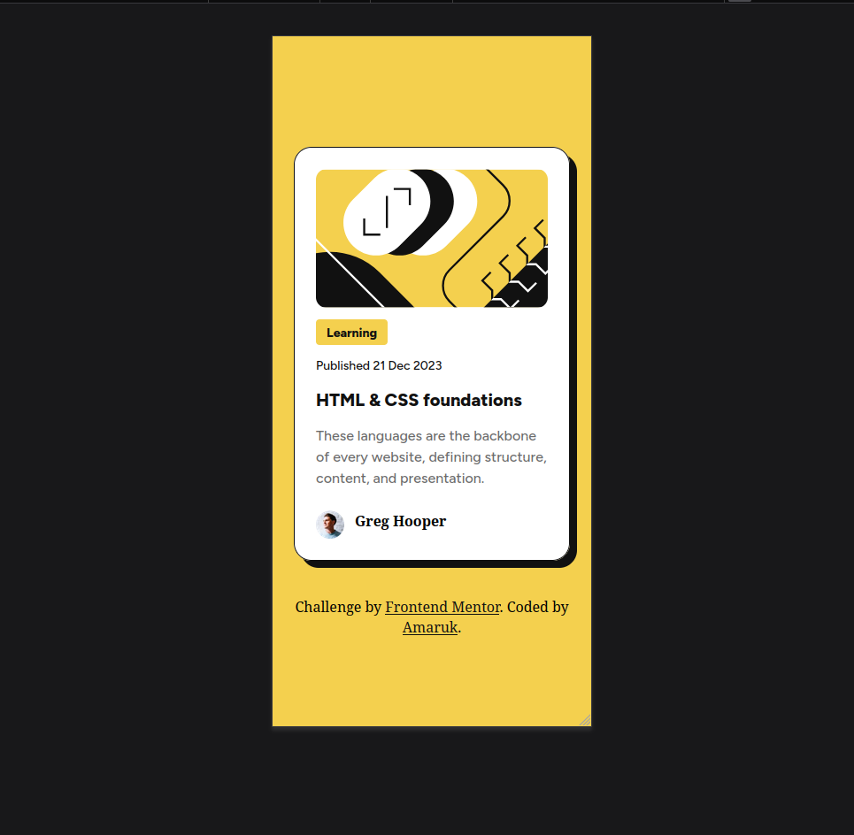

# Frontend Mentor - Blog preview card solution

This is a solution to the [Blog preview card challenge on Frontend Mentor](https://www.frontendmentor.io/challenges/blog-preview-card-ckPaj01IcS). Frontend Mentor challenges help you improve your coding skills by building realistic projects.

## Table of contents

- [Overview](#overview)
  - [The challenge](#the-challenge)
  - [Screenshot](#screenshot)
  - [Links](#links)
- [My process](#my-process)
  - [Built with](#built-with)
  - [What I learned](#what-i-learned)
  - [Useful resources](#useful-resources)
- [Author](#author)

## Overview

### The challenge

The challenge was to layout the blog preview card as close as possible to the Figma design.

Users should be able to:

- See the color of the card title change to the accent color when hovering the mouse over.

### Screenshot

 Desktop
 Mobile

### Links

- Solution URL: [https://github.com/DevAmaruk/Blog-Preview-Card](https://github.com/DevAmaruk/Blog-Preview-Card)
- Live Site URL: [https://devamaruk.github.io/Blog-Preview-Card/](https://devamaruk.github.io/Blog-Preview-Card/)

## My process

### Built with

- Semantic HTML5 markup
- CSS custom properties
- Flexbox
- Mobile-first workflow

### What I learned

- The Grid system to layout the blog card content properly.
- How to change an element status when hovered by mouse.

### Useful resources

- [Coder coder : How to make your website responsive ](https://www.youtube.com/watch?v=vQDgoQKfdzM) - Her course was helpful to understand how to use the clamp function on font-size.
- [Coder coder : CSS Grid for Beginners ](https://www.youtube.com/watch?v=RKWvnCrKizI&t=1547s) - Her course was helpful to understand how Grid works.
- [CSS Tricks - Grid Guide](https://css-tricks.com/complete-guide-css-grid-layout/) - Very useful guide to understand Grid

## Author

- Github - [Devamaruk](https://github.com/DevAmaruk)
- Frontend Mentor - [@DevAmaruk](https://www.frontendmentor.io/profile/DevAmaruk)
- Linkedin - [Jonathan Guthauser](https://www.linkedin.com/in/jguthauser/)
